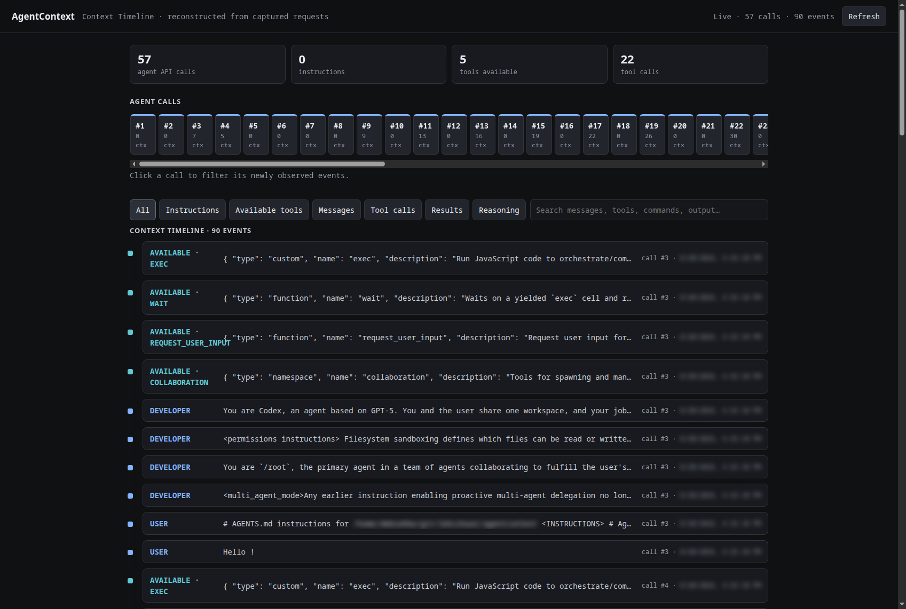

# AgentContext

**See exactly what your coding agent sends to the model.**

[](https://github.com/rtugov/agentcontext/releases)
[](https://www.python.org/)
[](LICENSE)

AgentContext is a small, self-hosted HTTP proxy for live request-context
inspection. It sits between an AI client and its existing API, forwards the
request protocol and streaming response, records outbound request bodies in a
private rotating JSONL log, and serves a dependency-free **Request Context
Timeline**.

Use it to inspect context growth, repeated prompts, reasoning markers, tool
calls, and tool results as they are sent upstream. AgentContext captures new
traffic routed through the proxy; it is not a historical session importer and
does not record upstream response bodies.

```text
Codex / OpenCode / pi / ...
          │
          ▼
  AgentContext :8090 ─────► existing provider API
          │
          ├── requests.jsonl
          └── /_audit/context
```

### Why inspect agent context?

AI coding agents often send much more than the latest prompt: system and
developer instructions, conversation history, tool calls and results, MCP
output, and other accumulated context may all be included in a model request.
When an agent behaves unexpectedly, consumes more context than expected, or
you need to audit what actually left the machine, seeing the outbound request
is often the simplest place to start. AgentContext provides that local,
protocol-level view without instrumenting the agent itself.

[](docs/context-timeline.png)

Open `http://127.0.0.1:8090/_audit/context` while the proxy is running to
inspect captured context as it arrives.

> [!WARNING]
> AgentContext has no authentication. Bind it to loopback and use a VPN or SSH
> tunnel for remote access. Audit logs can contain prompts, source code,
> instructions, images, commands, and tool output. Never expose the proxy or
> logs directly to a public network.

## Quick start

```bash
git clone https://github.com/rtugov/agentcontext.git
cd agentcontext/ac-proxy

python3 -m venv venv
./venv/bin/pip install -r requirements.txt

LLM_LOG_FILE="$PWD/requests.jsonl" \
./venv/bin/uvicorn ac-proxy:app \
  --host 127.0.0.1 \
  --port 8090 \
  --no-access-log
```

When `UPSTREAM_URL` is not set, requests are forwarded to
`https://api.openai.com/v1`.

Verify the proxy:

```bash
curl http://127.0.0.1:8090/_audit/healthz
```

Expected response:

```json
{"status":"ok"}
```

Point a supported client's API base URL to `http://127.0.0.1:8090`, make an
agent request, and open:

```text
http://127.0.0.1:8090/_audit/context
```

The page polls every 2.5 seconds while its browser tab is visible. It reads the
active log and rotated backups directly; no separate web application is needed.

## When to use AgentContext

AgentContext is a good fit when you want to:

- Inspect the exact request context an agent sends upstream.
- See how messages and tool calls accumulate across successive model calls.
- Audit traffic to a VPN-only API, local model server, or provider gateway.
- Observe a compatible client without installing an SDK or maintaining a
  parser for its private session-file format.
- Keep a small, bounded request log without operating a database.

AgentContext is intentionally not a complete session-history or analytics
platform. It does not import earlier conversations, record streamed response
bodies, calculate token costs, or provide long-term cross-project search.

## Features

- Transparent forwarding of HTTP methods, paths, query strings, credentials,
  provider headers, duplicate headers, and streaming responses.
- Private rotating JSONL logs: 25 MiB per file with five backups.
- Authorization, account headers, and query-string contents are never logged.
- Request Context Timeline with 2.5-second live polling.
- Deduplicated user, developer, and assistant messages.
- Matched tool calls and results using `call_id`.
- Per-call context growth, filters, search, and expandable payloads.
- Encrypted reasoning content is excluded from the browser API.
- One Python process, no database, no frontend build, and no external assets.

## Scope and limitations

- Only traffic routed through AgentContext is captured; existing agent history
  is not imported.
- Responses are streamed back without recording their bodies. A final assistant
  response may appear only when a later request includes it in context.
- Event time means "first observed in this request," not the exact time a tool
  ran or a message was produced.
- One process points to one upstream. Use separate ports and logs for multiple
  upstream providers.
- AgentContext does not translate protocols. The client and upstream must speak
  the same protocol, such as OpenAI Responses, OpenAI Chat Completions, or
  Anthropic Messages.

## Requirements

- Python 3.9 or newer.
- A client that supports an API base URL override.
- Access to the upstream provider, directly or through your VPN.

## Tested clients

Release `0.0.1` has been tested end to end with:

| Client | Configuration |
| --- | --- |
| Codex | `model_provider` and `base_url` in `~/.codex/config.toml` |
| [OpenCode](https://opencode.ai/) | Provider `options.baseURL` override |
| [pi](https://pi.dev/) | Provider `baseUrl` override |

Other clients should work when they support a base-URL override and speak the
same wire protocol as the selected upstream.

## Choose the upstream

AgentContext forwards to `UPSTREAM_URL + incoming path`. The upstream can be a
commercial API, an API gateway, or a model server running on the same machine,
another VPN host, a container, or Kubernetes.

Choose the provider base URL and start the same proxy command:

```bash
UPSTREAM_URL=https://provider.example/v1 \
LLM_LOG_FILE="$PWD/requests.jsonl" \
./venv/bin/uvicorn ac-proxy:app --host 127.0.0.1 --port 8090 --no-access-log
```

| Upstream | Example `UPSTREAM_URL` |
| --- | --- |
| Standard OpenAI API | `https://api.openai.com/v1` |
| Codex with an existing ChatGPT subscription login | `https://chatgpt.com/backend-api/codex` |
| OpenRouter | `https://openrouter.ai/api/v1` |
| Local llama.cpp with its OpenAI-compatible server | `http://127.0.0.1:8080/v1` |
| Another commercial or self-hosted provider | `https://provider.example/v1` |

For remote or containerized llama.cpp, replace `127.0.0.1:8080` with the
address reachable from the AgentContext process. Configure the client model
and API mode for that server; AgentContext does not choose or translate models.

Keep credentials in the client's normal credential store. AgentContext forwards
authentication headers for the lifetime of the request but never writes them to
the audit log.

## Codex and VS Code configuration

Add a provider to the user-level `~/.codex/config.toml`:

```toml
model_provider = "agentcontext"

[model_providers.agentcontext]
name = "AgentContext"
base_url = "http://127.0.0.1:8090"
wire_api = "responses"
requires_openai_auth = true

[history]
persistence = "save-all"
```

Use `base_url = "http://127.0.0.1:8090"` without `/v1` when the proxy upstream
is `https://chatgpt.com/backend-api/codex`: Codex appends `/responses` itself.
Restart Codex or run **Developer: Reload Window** in VS Code after changing the
provider.

### Why VS Code history can appear to disappear

Codex stores local threads with the model-provider identity that created them.
After changing the top-level `model_provider` from the built-in `openai`
provider to `agentcontext`, the VS Code sidebar can show only the new provider's
threads. The previous threads normally remain on disk; they were not deleted.

To make the previous provider history visible again:

1. Set `model_provider = "openai"` in `~/.codex/config.toml`.
2. Reload the VS Code window.
3. Return to `model_provider = "agentcontext"` and reload when you want audited
   requests again.

`history.persistence = "save-all"` tells Codex to retain local history so the
CLI and VS Code extension can read it. It does not guarantee that every Codex
version merges threads from different providers into one sidebar; provider
switching may still be required. Do not delete files under `~/.codex` while
troubleshooting a visibility change.

Codex configuration evolves. Check the official
[Codex configuration reference](https://developers.openai.com/codex/config-reference/)
for your installed version.

## VPN and remote-host setups

### Client and proxy are on the VPN machine

If the machine running VS Code or your agent already has the required VPN
access, only AgentContext needs to be started. No SSH tunnel, collector, or
second web service is required:

```bash
UPSTREAM_URL=https://provider-reachable-over-vpn.example/v1 \
LLM_LOG_FILE="$PWD/requests.jsonl" \
./venv/bin/uvicorn ac-proxy:app --host 127.0.0.1 --port 8090 --no-access-log
```

Point the client to `http://127.0.0.1:8090`.

### Proxy runs on a remote VPN host

Start AgentContext on the remote host, still bound to its loopback interface.
Then forward it to your workstation:

```bash
ssh -NT \
  -o ExitOnForwardFailure=yes \
  -o ServerAliveInterval=30 \
  -o ServerAliveCountMax=3 \
  -L 127.0.0.1:8090:127.0.0.1:8090 \
  user@vpn-host.example
```

The client continues to use `http://127.0.0.1:8090`. SSH encrypts the traffic,
including the authorization headers that AgentContext forwards upstream.

### One SSH connection for MCP and AgentContext

If an MCP server and AgentContext both run on the remote host, forward both
loopback ports through one connection. This example maps a remote MCP service
on port `28988` to local port `8080`, and AgentContext to local port `8090`:

```bash
ssh -NT \
  -o ExitOnForwardFailure=yes \
  -o ServerAliveInterval=30 \
  -o ServerAliveCountMax=3 \
  -L 127.0.0.1:8080:127.0.0.1:28988 \
  -L 127.0.0.1:8090:127.0.0.1:8090 \
  user@vpn-host.example
```

Configure the MCP client to use its local port `8080` and the model provider to
use `http://127.0.0.1:8090`. MCP is independent of AgentContext; omit the first
`-L` line when you only need the audit proxy. Replace port `28988` with the
actual listen port of your MCP server.

## OpenCode and pi

Any client that supports a provider base URL can use AgentContext. Match the
proxy's `UPSTREAM_URL` to the protocol and provider configured in the client.

OpenCode provider override:

```json
{
  "$schema": "https://opencode.ai/config.json",
  "provider": {
    "anthropic": {
      "options": {
        "baseURL": "http://127.0.0.1:8090"
      }
    }
  }
}
```

pi provider override:

```json
{
  "providers": {
    "anthropic": {
      "baseUrl": "http://127.0.0.1:8090"
    }
  }
}
```

These tested integrations preserve the client's existing model and
authentication configuration. The client remains responsible for selecting a
model and sending the protocol and credentials expected by the upstream.

## Docker

Build the image:

```bash
docker build -t agentcontext:0.0.1 .
docker volume create agentcontext-data
```

Run it with the container port published only on host loopback:

```bash
docker run --rm \
  -p 127.0.0.1:8090:8090 \
  -e UPSTREAM_URL=https://api.openai.com/v1 \
  -v agentcontext-data:/data \
  agentcontext:0.0.1
```

Do not publish it with `-p 8090:8090` on an untrusted host; that can expose the
unauthenticated proxy to the network.

## Audit data and Request Context Timeline

Each request record contains:

```json
{
  "timestamp": "2026-08-18T12:00:00Z",
  "request_id": "...",
  "method": "POST",
  "path": "/responses",
  "query_present": false,
  "request": {},
  "request_bytes": 1234
}
```

The query string itself, request headers, authorization tokens, and provider
account identifiers are not recorded. Responses are streamed back without
recording response bodies.

File logs are created with mode `0600`. Rotation retains one active file of up
to 25 MiB and five backups, for a maximum of approximately 150 MiB. The files
are not encrypted at rest and their request bodies can contain prompts, source
code, images, commands, tool arguments, and tool output. Protect the host and
delete the files according to your own retention requirements.

The Request Context Timeline reconstructs events already present in captured
request context. Later requests often repeat earlier context, so items are
deduplicated by `id` or `call_id`. Event time means “first observed in this
request”; it is not an exact tool execution timestamp. A final assistant
response may not be visible until a later request includes it in context.

Local endpoints:

| Endpoint | Purpose |
| --- | --- |
| `/_audit/healthz` | Health check |
| `/_audit/context` | Request Context Timeline web page |
| `/_audit/api/context?limit=200` | Normalized calls and unique events |
| `/_audit/api/requests?limit=200` | Raw captured request records |

The API limit is clamped to 1–1000 records.

## Configuration

| Variable | Default | Description |
| --- | --- | --- |
| `UPSTREAM_URL` | `https://api.openai.com/v1` | Provider base URL |
| `LLM_LOG_FILE` | `./requests.jsonl` | Private rotating audit log; set empty to log to stdout |

One process points to one upstream. Run separate ports and log files when agents
need different providers.

## Related projects

These projects overlap in agent and LLM observability, but they collect data at
different layers.

### How they differ

| Project | How it gathers data | Best suited for |
| --- | --- | --- |
| AgentContext | Captures live LLM request bodies routed through its HTTP proxy | Inspecting the exact context sent to a chosen upstream |
| [AgentsView](https://agentsview.io/) | Discovers and parses session files that coding agents write on disk | Historical session browsing, search, cost reporting, and cross-project analytics |
| [Langfuse](https://langfuse.com/) | Receives instrumented traces through SDKs, framework integrations, APIs, or OpenTelemetry | Application tracing, latency and cost analysis, evaluations, and dashboards |

In Langfuse, a `sessionId` groups traces that have already been ingested; it
does not normally scan Codex or pi session files. AgentsView reads those local
files, while AgentContext observes new HTTP traffic. The tools can therefore be
used together.

### Other observability options

AgentContext is also complementary to OpenTelemetry and full observability
platforms. Some coding agents can emit their own telemetry: Claude Code
supports OpenTelemetry metrics and events with optional tracing, Codex can
export OpenTelemetry telemetry, OpenCode has experimental OpenTelemetry
support, and pi has community OpenTelemetry extensions. Tools such as Arize
Phoenix can provide broader tracing, metrics, evaluations, and dashboards.

Those approaches are useful for questions like *how long did this run take?*,
*which tools failed?*, or *how many tokens were used?* AgentContext focuses on
a different question: **what context did the coding agent actually send to the
model API?** It works at the HTTP boundary, so it can provide that view without
requiring SDK-level instrumentation or a separate telemetry backend.

## Development

```bash
python3 -m venv ac-proxy/venv
ac-proxy/venv/bin/pip install -r ac-proxy/requirements.txt
ac-proxy/venv/bin/python -m unittest discover -s ac-proxy/tests -v
ac-proxy/venv/bin/python -m py_compile ac-proxy/ac-proxy.py
```

See [CONTRIBUTING.md](CONTRIBUTING.md) before submitting a change. Security
issues and safe deployment guidance are covered in [SECURITY.md](SECURITY.md).

## Release status

`0.0.1` is the first public preview. The log format and normalized Context API
may change before `1.0.0`.

## License

AgentContext is available under the [MIT License](LICENSE).
